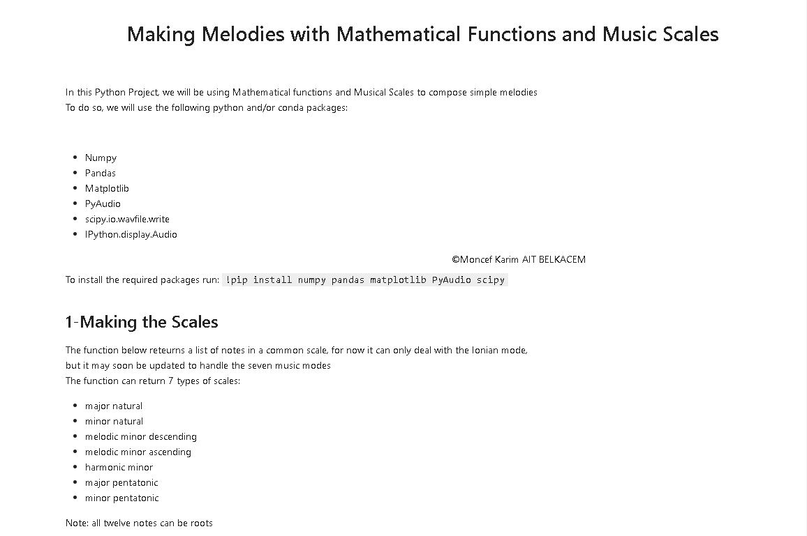
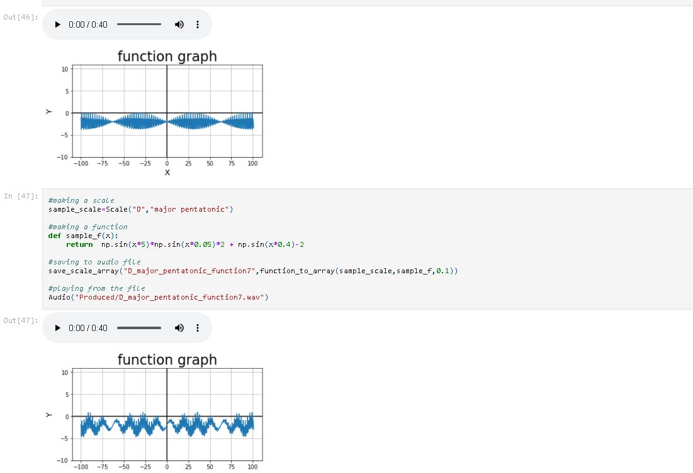
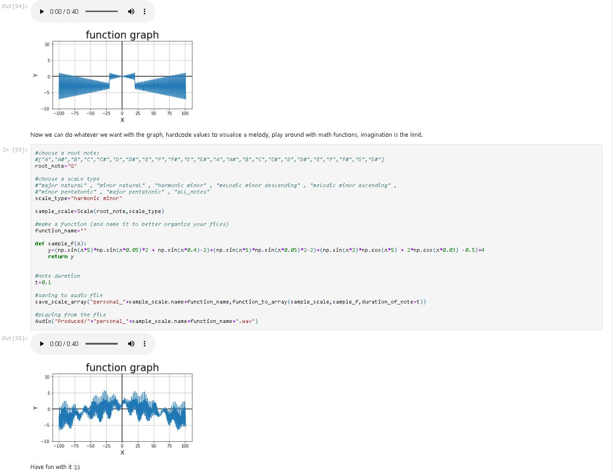

# musi-math
<b>
A python project that combines music scales with math functions to make melodies
  
If you have jupyter notebook installed on your system, go ahead and clone this repository and open the "Music_Production.ipynb" in the jupyter notebook editor. 
If you don't, download the "Music_Production.html" and open it in your web browser. If you have a slow internet connection (65mb!), open the /archives folder and download a compressed version of the html notebook.
  </b>
 

